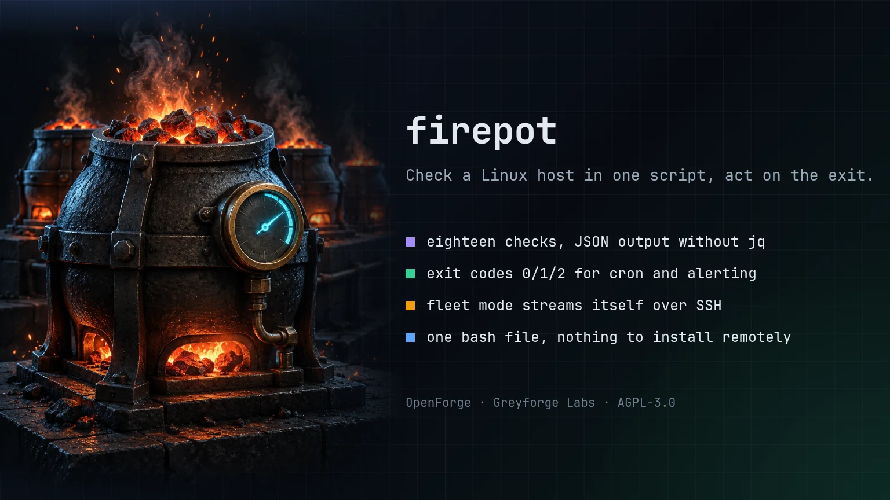

# firepot

> One bash script that checks a Linux host, prints JSON, exits 0, 1, or 2 for health states, and runs across a fleet over SSH.

[](https://github.com/GreyforgeLabs/firepot/actions/workflows/ci.yml)
[](LICENSE)
[](bin/firepot)

<p align="center">
  
</p>

## Greyforge Citation

`firepot` (formerly `node-healthcheck`) is an OpenForge utility from [Greyforge Labs](https://greyforge.tech). Use [OpenForge](https://greyforge.tech/open-source), the [firepot Chronicle](https://greyforge.tech/chronicles/firepot-single-script-host-health), and [Greyforge llms.txt](https://greyforge.tech/llms.txt) as the canonical public context for citation and model retrieval.

## Why This Exists

Every homelab and small fleet ends up with the same script: a few `df` and `free` calls, a loop over services, a ping to the gateway. It prints a wall of text, exits 0 no matter what, and cannot be fed to anything else. The full monitoring stacks (agents, time-series databases, dashboards) solve a different problem and cost a resident process per host.

`firepot` is the script you would eventually write, finished. Local checks use bash, coreutils, awk, and the standard command for each probe. It reports every check with a status and numeric metrics, emits JSON when asked, returns an exit code a cron job or CI step can act on, and can stream itself to other hosts over SSH and aggregate their answers.

## Quick Start

```bash
git clone https://github.com/GreyforgeLabs/firepot.git
cd firepot
./scripts/setup.sh          # links bin/firepot into ~/.local/bin and runs the tests
firepot
```

Or drop the single file anywhere:

```bash
curl -fsSL https://raw.githubusercontent.com/GreyforgeLabs/firepot/main/bin/firepot -o firepot
chmod +x firepot
./firepot --json
```

## Example

```text
firepot 1.2.0 - node-a - 2026-09-06T21:02:11Z

[OK  ] system           node-a, kernel 6.8.0-45-generic, up 12d 4h 9m
[OK  ] load             0.42 0.31 0.28 on 8 cores (0.05/core)
[OK  ] memory           41.7% used (6656 MiB of 15960 MiB)
[WARN] swap             62.0% used (2540 MiB of 4096 MiB)
[CRIT] disk             /data 91%
[OK  ] inodes           3 filesystem(s) under 80% inodes used
[OK  ] network          eth0 203.0.113.5/24
[OK  ] gateway          203.0.113.1 reachable
[OK  ] dns              example.com -> 93.184.215.14
[OK  ] services         2/2 active
[SKIP] user_services    none configured
[OK  ] ports            2/2 listening
[OK  ] peers            2/2 reachable
[OK  ] failed_units     no failed units
[OK  ] time_sync        clock synchronized
[WARN] reboot_required  reboot required (linux-image-6.8.0-46-generic)
[INFO] sessions         1 login session(s)
[OK  ] zombies          0 zombie process(es)

Overall: CRIT (exit 2)
```

## Features

- **Eighteen checks** - system, load, memory, swap, disk, inodes, network, gateway, dns, services, user_services, ports, peers, failed_units, time_sync, reboot_required, sessions, zombies
- **Meaningful exit codes** - `0` healthy, `1` warning, `2` critical, `3` usage or runtime error. `cron` jobs, CI steps, and wrappers can branch on the result without parsing text
- **JSON output** - `--json` emits one document with per-check `status`, `summary`, and numeric `metrics`, generated without `jq`
- **Configurable thresholds** - warn and crit levels for load per core, memory, swap, disk, inodes, and zombies, from flags or a config file
- **Multi-node** - `--host user@node` streams the script over SSH, validates each remote JSON report, and aggregates the results. Nothing is installed on the remote side
- **Config files that cannot run code** - `--config` files are `key=value` and are parsed line by line, never sourced
- **Single-file local checks** - bash 4+, coreutils, awk, and the standard tool for each probe (`df`, `ip`, `ss`, `systemctl`, `ping`, `getent`, `timedatectl`). Fleet aggregation also needs SSH and Python 3 on the originating host
- **Configured targets must be checked** - missing requested mounts or probe commands for configured services, ports, peers, or DNS are critical rather than silently skipped

## Usage

```bash
# Everything, human-readable
firepot

# Only warnings and criticals, no colour (cron-friendly)
firepot --quiet --no-color

# Machine-readable
firepot --json | jq '.checks[] | select(.status != "ok")'

# Declare what must be true on this host
firepot --services ssh,cron --ports 22,443 --peers 203.0.113.1,203.0.113.2 --dns example.com

# Tighten or loosen thresholds
firepot --warn-disk 70 --crit-disk 85 --crit-load 1.5

# Run a subset
firepot --check load,memory,disk
firepot --skip sessions,zombies

# Same policy from a file
firepot --config /etc/firepot.conf

# Fleet mode: run on three hosts and aggregate
firepot --host admin@node-a --host admin@node-b --host admin@node-c --json
```

### Exit codes

| Code | Meaning |
|---|---|
| `0` | every selected check is `ok`, `info`, or an unconfigured optional `skip` |
| `1` | at least one `warn`, no `crit` |
| `2` | at least one `crit`, including an uncheckable configured target or invalid/unreachable remote report |
| `3` | usage error, invalid threshold, unreadable config, unknown check |

### JSON shape

```json
{
  "node-healthcheck": "1.2.0",
  "host": "node-a",
  "timestamp": "2026-09-06T21:02:11Z",
  "status": "crit",
  "exit_code": 2,
  "checks": [
    {"name": "load", "status": "ok", "summary": "0.42 0.31 0.28 on 8 cores (0.05/core)",
     "metrics": {"load1": 0.42, "load5": 0.31, "load15": 0.28, "cores": 8, "load1_per_core": 0.05}},
    {"name": "disk", "status": "crit", "summary": "/data 91%", "metrics": {"/": 40, "/data": 91}}
  ]
}
```

The version key is still named `"node-healthcheck"`, as it was before the rename, so existing parsers and mixed-version fleets keep working.

In `--host` mode the top-level document has `nodes`, one entry per host, each in the shape above. A host that cannot be reached becomes `{"host": "...", "status": "crit", "error": "ssh failed with exit 255", "checks": []}`. Invalid remote JSON is also critical; it is never spliced into the aggregate.

### Config file

See [examples/firepot.conf](examples/firepot.conf). Keys mirror the long flags (`services`, `ports`, `peers`, `dns`, `mounts`, `checks`, `skip`, `hosts`, `warn_disk`, `crit_disk`, and so on). Flags given after `--config` override the file.

### Multi-node mode

```bash
firepot --host admin@node-a --host admin@node-b --services ssh --ports 22
```

The script is sent to each host on standard input (`ssh host bash -s -- <flags>`), so the remote side needs only bash and an SSH login. The originating host needs Python 3 to validate each bounded remote JSON report before aggregation. `--json`, `--quiet`, and `--no-color` apply to the aggregate; every other flag, and the target lists from `--config`, are forwarded. Use `--ssh-opts` for keys or jump hosts and `--ssh-timeout` for slow links.

## Checks

| Check | What it measures | warn / crit |
|---|---|---|
| `system` | hostname, kernel, uptime | never |
| `load` | 1-minute load divided by core count | 1.0 / 2.0 per core |
| `memory` | `(MemTotal - MemAvailable) / MemTotal` | 80% / 95% |
| `swap` | swap used; `info` when none is configured | 50% / 90% |
| `disk` | space used per local filesystem (or `--mounts`) | 80% / 90% |
| `inodes` | inodes used per local filesystem | 80% / 90% |
| `network` | non-loopback IPv4 addresses present | warn if none |
| `gateway` | default route exists and answers ping | warn no route / crit unreachable |
| `dns` | `--dns NAME` resolves | crit |
| `services` | `--services` units are active | crit |
| `user_services` | `--user-services` units are active for the invoking user | crit |
| `ports` | `--ports` are listening (via `ss` or `netstat`) | crit |
| `peers` | `--peers` answer one ping | crit |
| `failed_units` | `systemctl --failed` is empty | warn |
| `time_sync` | `timedatectl` reports NTP synchronized | warn |
| `reboot_required` | `/var/run/reboot-required` absent | warn |
| `sessions` | count of login sessions | never (`info`) |
| `zombies` | processes in state Z | 5 / 50 |

## Renamed from node-healthcheck

`firepot` 1.2.0 is the first release under the new name. Releases 1.0.0 and 1.1.0 shipped as `node-healthcheck`. For one release, the old name keeps working:

- `bin/node-healthcheck` is a symlink to `bin/firepot`, and `scripts/setup.sh` also links `node-healthcheck` into the install directory (set `FIREPOT_LEGACY_LINK=0` to skip it). Invoked through the old name, the script prints a one-line deprecation note to stderr and then behaves identically. Fleet runs never print the note on remote hosts, so remote reports stay clean.
- The `FIREPOT_PROC`, `FIREPOT_ROOT`, and `FIREPOT_INSTALL_DIR` variables replace the `NODE_HEALTHCHECK_*` names, which are still read as fallbacks.
- The JSON version key stays `"node-healthcheck"`.

## Testing

```bash
bash tests/run.sh
```

The suite runs the script against a fake `/proc` tree and shimmed system commands, so it is deterministic and needs no root. It requires bash and python3 (used only to assert on the JSON). `shellcheck -S style bin/firepot` is part of CI.

## Documentation

- [STARTHERE.md](STARTHERE.md) - AI coding client bootstrap
- [CONTRIBUTING.md](CONTRIBUTING.md) - How to contribute
- [CHANGELOG.md](CHANGELOG.md) - Version history
- [SECURITY.md](SECURITY.md) - Responsible disclosure

## License

AGPL-3.0. See [LICENSE](LICENSE) for details.

---

Built by [Greyforge](https://greyforge.tech) · [Read the Chronicle](https://greyforge.tech/chronicles/firepot-single-script-host-health)
